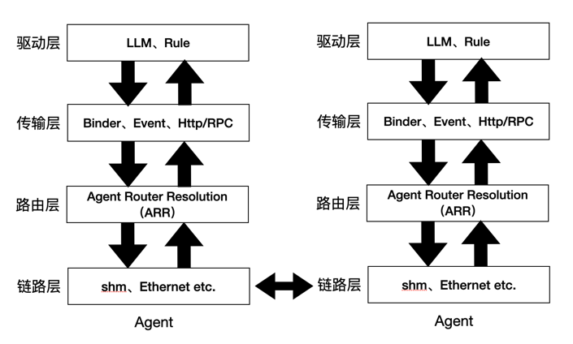

# Touchpoint Protocol

`touchpoint-protocol` ，触点协议（TPP协议），一个Agent之间通信的协议，该协议通过AI模型驱动Agent之间的关系，是智联网的通信标准。

## 核心功能

- **多种Agent架构：** 不同Agent可在一个进程，也可分属不同进程，及不同Agent可部署在不同的终端上。

- **多种Agent执行模式：** 不同Agent可以并行，也可以串行执行。

- **多种Agent文件格式：** 支持apk、jar、exe、ipa、py等文件格式。

- **可热插拔Agent：** Agent网络中的任意一个Agent都可在线加入和退出，不影响整个Agent网络。

- **共享触点对象：** Agent之间共享触点对象，通过触点对象交换数据，无需关心交换形式是IPC、消息队列、RPC、还是REST等。

- **多级模型驱动：** LLM驱动可以作用在全流程，也可以作用在Agent及Action。

- **多级调用策略：** 调用策略可以作用在全流程， 也可以作用在Action上。

- **多种LLM：** 支持多种LLM，如GPT-3、GPT-3.5、GPT-4、Claude-3、Claude-3.5等。

## 架构

<div align="center">
  
</div>

## 使用指南

### 导入依赖

在你的 `build.gradle` 文件中添加以下依赖：

```gradle
dependencies {
    implementation 'com.universe.touchpoint:touchpoint-protocol:1.0.0'
}
```

### Example

以获取上海天气为例，其中，有一个入口Entry Agent和一个Weather Agent。

### 实现Agent

#### Entry Agent

`EntryApplication` 继承 `AgentApplication`
```kotlin
@TouchPointAgent(name = "entry_agent")
@TaskProposer // 是否任务发起者，添加该注解表示该Agent是任务发起者
@Dubbo(applicationName = "entry_agent") // 可选的全局配置，指定dubbo应用名和注册中心地址
class EntryApplication : AgentApplication()
```

在` Entry Agent` 中执行
```kotlin
AgentBuilder builder = AgentBuilder
    .model(Model.GPT_4) // 选择模型
    .setTemperature(0.0) // 设置温度
    .setModelApiKey("My API Key") // 设置模型API Key
    .build();

builder.run("我想查询上海天气");
```

#### Weather Agent

`WeatherApplication` 继承 `AgentApplication`
```kotlin
@TouchPointAgent(name = "weather_agent", desc = "查询城市的天气信息")
@Dubbo(applicationName = "weather_agent", registryAddress = "127.0.0.1:2181") // 可选，指定dubbo应用名和注册中心地址
class WeatherApplication : AgentApplication()
```
如果希望 `Weather Agent` 使用指定LLM，可以配置如下：
```kotlin
/**
 * model默认使用o1
 */
@TouchPointAgent(name = "weather_agent", desc = "查询城市的天气信息")
@AIModel(name = Model.GPT_4, temperature = 0.0f) // 指定模型, 默认使用o1
class WeatherApplication : AgentApplication()
```

定义获取天气的响应类
```kotlin
data class WeatherResponse(val weather: String, val temperature: String) : TouchPoint()
```

监听来自 `Entry Agent` 的Action，并返回天气信息。
```kotlin
@TouchPointAction(
    name = "weather_action",
    fromAgents = {"entry_agent"}, // 可以指定多个来源Agent
    fromActions = {""} // 可以指定多个来源Action
    taskProposers = {"entry_agent"} // 可以指定多个任务发起者
) 
@AIModel(name = Model.GPT_4, temperature = 0.0f) // 指定模型, 默认使用o1
class WeathertListener : AgentActionListener<String, WeatherResponse> {

    override fun onReceive(city: String, context: Context) : WeatherResponse {
        val client = OkHttpClient()

        // 设置请求的 URL 和参数
        val url = "$BASE_URL?q=$city&appid=$WEATHER_API_KEY&units=metric&lang=zh_cn"
        
        // 创建请求对象
        val request = Request.Builder()
            .url(url)
            .build()
    
        // 发送请求并获取响应
        val response: Response = client.newCall(request).execute()
    
        // 解析 JSON 响应
        if (response.isSuccessful) {
            val jsonResponse = response.body?.string()
    
            // 使用 Moshi 来解析 JSON
            val moshi = Moshi.Builder().add(KotlinJsonAdapterFactory()).build()
            val jsonAdapter = moshi.adapter(WeatherResponse::class.java)
    
            val weatherResponse = jsonAdapter.fromJson(jsonResponse)
    
            return if (weatherResponse != null) {
                val weatherDescription = weatherResponse.weather[0].description
                val temperature = weatherResponse.main.temp
                WeatherResponse(weatherDescription, temperature.toString())
            } else {
                throw RunTimeException("无法解析天气信息。")
            }
        } else {
            throw RunTimeException("无法获取天气信息，请检查城市名称是否正确。")
        }
    }

}
```

如果希望 `weather_action` 使用Dubbo协议，可以配置如下：
```kotlin
@TouchPointAction(
    name = "weather_action",
    fromAgent = {"entry_agent"}, // 可以指定多个来源Agent
    taskProposers = {"entry_agent"} // 可以指定多个任务发起者
) 
@AIModel(name = Model.GPT_4, temperature = 0.0f) // 指定模型, 默认使用o1
@DubboService(interfaceClass = IWeatherService::class) //必须指定接口
class WeatherService {

    override fun query(city: String) : WeatherResponse {
        val client = OkHttpClient()

        // 设置请求的 URL 和参数
        val url = "$BASE_URL?q=$city&appid=$WEATHER_API_KEY&units=metric&lang=zh_cn"
        
        // 创建请求对象
        val request = Request.Builder()
            .url(url)
            .build()
    
        // 发送请求并获取响应
        val response: Response = client.newCall(request).execute()
    
        // 解析 JSON 响应
        if (response.isSuccessful) {
            val jsonResponse = response.body?.string()
    
            // 使用 Moshi 来解析 JSON
            val moshi = Moshi.Builder().add(KotlinJsonAdapterFactory()).build()
            val jsonAdapter = moshi.adapter(WeatherResponse::class.java)
    
            val weatherResponse = jsonAdapter.fromJson(jsonResponse)
    
            return if (weatherResponse != null) {
                val weatherDescription = weatherResponse.weather[0].description
                val temperature = weatherResponse.main.temp
                WeatherResponse(weatherDescription, temperature.toString())
            } else {
                throw RunTimeException("无法解析天气信息。")
            }
        } else {
            throw RunTimeException("无法获取天气信息，请检查城市名称是否正确。")
        }
    }

}
```

## 高级用法

（[如何降级为非模型驱动的Agent编排？](./README_BASIC.md)）

## RoadMap

1. **新增注解方式注入和使用**
2. **实现跨端Agent连接**
