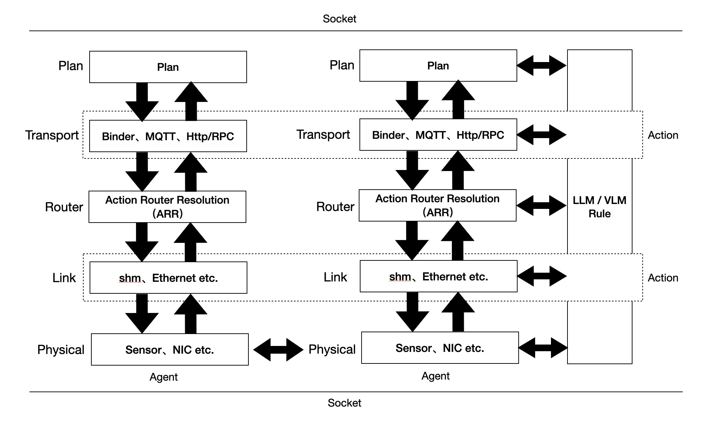

# Touchpoint Protocol

## Overview

The Touchpoint Protocol (TPP) is a collaboration communication protocol between agents, driven by AI models to facilitate inter-agent collaboration. It serves as the collaboration communication standard for the Intelligent Network (Smart Internet).

### Why Use TPP?

The TPP protocol adheres to the philosophy of "Anything is Action", redefining Agent Collaboration, achieving a truly adaptive multi-agent collaboration model.

- **Context-Role Driven Model**: Through the context-role driven model, multi-agents can autonomously adjust and optimize their collaboration relationships based on different scenarios and environments, without requiring human intervention.

- **Compatibility with Mainstream Internet Technologies**: The TPP protocol is primarily implemented in Java and is fully compatible with mainstream programming languages and operating systems in the Internet era. Based on annotations, developers almost never need to modify the app to turn it into an agent.

- **Disrupting Traditional API**: The TPP protocol revolutionizes traditional API integration methods. The two parties involved only need to agree on the touchpoint structure, without specifying communication protocols such as REST or RPC. The AI model will automatically select the appropriate protocol to facilitate communication between both sides.

- **Disrupting Traditional Function Extension Methods**: The TPP protocol presents a revolutionary collaborator paradigm. With this paradigm, developers can extend agent functionality in a non-intrusive, smooth, and lossless manner.

- **The Super Fusion of VLA and Agent Collaboration**: The TPP protocol thoroughly fuses the VLA model and agent collaboration, enabling deployment across any terminal, including but not limited to servers, mobile, glasses, cars, robots, drones, etc., truly achieving an "All in One".

## Key Features

- **Supports Multi-modal**: Handles text, images, audio, video, sensor data, etc., implementing the fusion of VLA and intelligent agents.

- **Supports Multiple Agent Forms**: Agents can be software, such as apps or TCP, or hardware, such as robots, cars, drones, server node, etc.

- **Supports Multiple Agent Architectures**: Agents can coexist within a single process, belong to different processes, or be deployed on different terminals.

- **Supports Multiple Action Execution Modes**: Actions can be executed in parallel or sequentially.

- **Supports Multiple Agent File Formats**: Compatible with Apk, Jar(Spring), exe, ipa, py, etc.

- **Hot-swappable Agents**: Any agent in the network can join or leave online without affecting the entire agent network.

- **Supports Dynamic Workflows**: Tasks and actions can be dynamically adjusted at runtime.

- **Supports Multiple Invocation Methods**: Actions can communicate through IPC, Broadcast, MQTT, RPC, REST, etc.

- **Multi-level Model-Driven**: AI models can be applied to agents, tasks, and actions.

- **Multi-level Invocation Strategies**: Invocation strategies can be applied to both agents and actions.

- **Supports Multiple AI Models**: The protocol supports various models, including GPT-3, GPT-3.5, GPT-4, Claude-3, Claude-3.5, DINOv2, SigLIP, OpenVLA etc.

## Architecture

<div align="center">
  
</div>

## Getting Started

### Import dependencies

Add the following dependency to your `build.gradle` file:
```gradle
dependencies {
    implementation 'com.universe.touchpoint:touchpoint-protocol:1.0.0'
}
```

### Example
Taking the Shanghai weather as an example, there is an `Entry Agent` and a `Weather Agent`.

### Binding Agents
If the `Entry Agent` and `Weather Agent` are deployed on the same node, you need to add the following code in `Entry Agent` to complete the binding:
```kotlin
// both Agents are APKs
AgentSocket.bind(./"weather_agent.apk", BinderType.ANDROID_BINDER);
```
Note:  
(1) Explicit binding is required only when multiple Agents are deployed in different APKs on the same node. If the multiple Agents are in the same APK, no explicit binding is required.  
(2) In all other cases, explicit binding is not required.

### Implementing Agents

#### Entry Agent

##### Android Application
`EntryApplication` extends `AgentApplication`:
```kotlin
/**
 * The bindProtocol specifies the protocol used to establish the collaboration relationship,
 * which applies to all tasks within the agent. The default is MQTT5.
 */
@TouchPointAgent(name = "entry_agent")
@AgentSocket(bindProtocol = SocketProtocol.MQTT5, brokerUri = "tcp://127.0.0.1:1883")
class EntryApplication : AgentApplication()
```
The TPP protocol includes two workflows: the collaboration establishment flow and the execution flow. The collaboration establishment flow is used to establish the collaboration relationship, while the execution flow is used for executing actions. Therefore, AgentSocket is configured for the collaboration establishment flow.

In `Entry Agent` , add the following code:
```kotlin
data class Entry {
    
    @Task("query_weather") // Specify the task
    @Dubbo(applicationName = "entry_agent", registryAddress = "127.0.0.1:2181") // Optional global configuration to specify the Dubbo app name and registry address
    @AIModel(name = Model.GPT_4, temperature = 0.0f, apiKey = "My API Key") // Specify the model, default is o1
    @AgentSocket(bindProtocol = SocketProtocol.MQTT5, brokerUri = "tcp://127.0.0.1:1883")
    val taskBuilder: TaskBuilder = TaskBuilder.task("query_weather");
    
    fun queryWeather() {
        taskBuilder.run("I want to query the weather in Shanghai")
    }

}
```
Note: The configuration above is for the task scope. The `Dubbo` annotation specifies the communication protocol for the collaboration execution flow, defaulting to `MQTT5`.

##### Spring Application
```java
@TouchPointAgent(name = "entry_agent")
@AgentSocket(bindProtocol = SocketProtocol.MQTT5, brokerUri = "tcp://127.0.0.1:1883")
@SpringBootApplication
public class EntryApplication {
    public static void main(String[] args) {
        SpringApplication.run(EntryApplication.class, args);
    }
}
```

In `Entry Agent` , add the following code:
```kotlin
public class Entry {
    
    @Task("query_weather") // Specify the task
    @Dubbo(applicationName = "entry_agent", registryAddress = "127.0.0.1:2181") // Optional global configuration to specify the Dubbo app name and registry address
    @AIModel(name = Model.GPT_4, temperature = 0.0f, apiKey = "My API Key") // Specify the model, default is o1
    @AgentSocket(bindProtocol = SocketProtocol.MQTT5, brokerUri = "tcp://127.0.0.1:1883")
    private Task task;
    
    fun queryWeather() {
        task.run("I want to query the weather in Shanghai")
    }

}
```

#### Weather Agent

##### Android Application
`WeatherApplication` extends `AgentApplication`
```kotlin
@TouchPointAgent(name = "weather_agent", desc = "Query weather information of a city")
@Dubbo(applicationName = "weather_agent", registryAddress = "127.0.0.1:2181") // Optional: Specify Dubbo app name and registry address
@AgentSocket(bindProtocol = SocketProtocol.MQTT5, brokerUri = "tcp://127.0.0.1:1883")
class WeatherApplication : AgentApplication()
```
If you want the `Weather Agent` to use a specific LLM, configure as follows:
```kotlin
/**
 * The default model is o1
 */
@TouchPointAgent(name = "weather_agent", desc = "Query weather information of a city")
@AIModel(name = Model.GPT_4, temperature = 0.0f) // Specify the model and temperature, default is o1
class WeatherApplication : AgentApplication()
```
Note: The configuration above applies to the agent scope. Any unconfigured actions on the agent will use this configuration.

##### Spring Application
```java
@TouchPointAgent(name = "weather_agent", desc = "Query weather information of a city")
@AgentSocket(bindProtocol = SocketProtocol.MQTT5, brokerUri = "tcp://127.0.0.1:1883")
@SpringBootApplication
public class WeatherApplication {
    public static void main(String[] args) {
        SpringApplication.run(WeatherApplication.class, args);
    }
}
```

Define the request and response classes for fetching weather:
```kotlin
data class WeatherRequest(val city: String) : TouchPoint()
```
```kotlin
data class WeatherResponse(val weather: String, val temperature: String) : TouchPoint()
```

Listen for actions from the `Entry Agent` and return the weather information:
```kotlin
@TouchPointAction(
    name = "weather_action",
    desc = "Query weather information of a city",
    toActions = {
        "entry_agent[\"next_action\"]", 
        "task2[next_action, next_action1, next_action2"]
    } //Format：task_name[action_name1, action_name2, ...]
) 
@AIModel(name = Model.GPT_4, temperature = 0.0f) // specify the model, default is o1
class WeatherService : AgentActionExecutor<WeatherRequest, WeatherResponse> {

    override fun run(cityRequest: WeatherRequest, context: Context) : WeatherResponse {
        val client = OkHttpClient()

        val url = "$BASE_URL?q=$city&appid=$WEATHER_API_KEY&units=metric&lang=zh_cn"
        
        val request = Request.Builder()
            .url(url)
            .build()
    
        val response: Response = client.newCall(request).execute()
    
        if (response.isSuccessful) {
            val jsonResponse = response.body?.string()
    
            // Use Moshi to parse JSON
            val moshi = Moshi.Builder().add(KotlinJsonAdapterFactory()).build()
            val jsonAdapter = moshi.adapter(WeatherResponse::class.java)
    
            val weatherResponse = jsonAdapter.fromJson(jsonResponse)
    
            return if (weatherResponse != null) {
                val weatherDescription = weatherResponse.weather[0].description
                val temperature = weatherResponse.main.temp
                WeatherResponse(weatherDescription, temperature.toString())
            } else {
                throw RunTimeException("Unable to parse weather information.")
            }
        } else {
            throw RunTimeException("Unable to get weather information. Please check if the city name is correct.")
        }
    }

}
```
Note: The `onReceive` method input and output in the above code must inherit `TouchPoint`.

If you want the `weather_action` to use the `Dubbo` protocol, configure as follows:
```kotlin
@TouchPointAction(
    name = "weather_action"
    desc = "Query weather information of a city",
) 
@AIModel(name = Model.GPT_4, temperature = 0.0f)
@DubboService(interfaceClass = IWeatherService::class) //Must specify the interface, this annotation is built-in for Dubbo
class WeatherService {

    override fun query(city: String) : WeatherResponse {
        val client = OkHttpClient()

        val url = "$BASE_URL?q=$city&appid=$WEATHER_API_KEY&units=metric&lang=zh_cn"
        
        val request = Request.Builder()
            .url(url)
            .build()
    
        val response: Response = client.newCall(request).execute()
    
        if (response.isSuccessful) {
            val jsonResponse = response.body?.string()
    
            val moshi = Moshi.Builder().add(KotlinJsonAdapterFactory()).build()
            val jsonAdapter = moshi.adapter(WeatherResponse::class.java)
    
            val weatherResponse = jsonAdapter.fromJson(jsonResponse)
    
            return if (weatherResponse != null) {
                val weatherDescription = weatherResponse.weather[0].description
                val temperature = weatherResponse.main.temp
                WeatherResponse(weatherDescription, temperature.toString())
            } else {
                throw RunTimeException("Unable to parse weather information.")
            }
        } else {
            throw RunTimeException("Unable to get weather information. Please check if the city name is correct.")
        }
    }

}
```
Note: The above configuration applies to the action scope. The priority of all configuration scopes is: Action > Task > Agent.

## More Usage
- [Dynamic Routing](./docs/README_ROLE.md)
- [Custom Context](./docs/README_CONTEXT.md)
- [VLA Model](./docs/README_VLA.md)
- [New Paradigm for Extended Functionality](./docs/README_EXTENSION.md)

## RoadMap

1. **Supports models like DeepSeek, Claude, etc.**
2. **Supports Agent file types such as jar, exe, ipa, py, etc.**
3. **Supports parallel execution of multiple Actions**
4. **Actionized transport layer**
