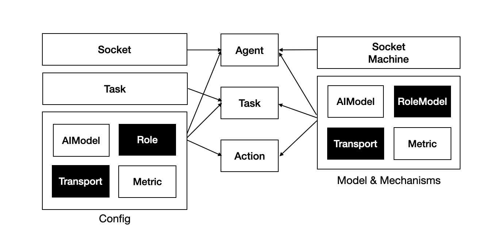

# 实体关系模型

## Design and implementation

  

### Configuration
- `Socket`: The communication method for agent negotiation and relationship establishment, currently supporting `MQTT`.
- `Task`: Task-related configurations, primarily including the task name.
- `AIModel`: AI model configuration, including model name, temperature, etc.
- `Role`: Role-related configurations used to specify coordinators, supervisors, and their roles within specific tasks.
- `Transport`: The communication protocol configuration between Actions, currently supporting `MQTT` and `RPC`.
- `Metric`: Task and Action metric thresholds and metric synchronization protocol configuration, with the synchronization protocol set to `MQTT`.

The `Socket` configuration applies to `Agents`, the `Task` configuration applies to `Tasks`, and other configurations can apply to `Agents`, `Tasks`, and `Actions`.

### Models and Mechanisms
- `SocketMachine`: Establishes collaboration relationships between Agents using a handshake mechanism. See [Negotiation Handshake](./README_HANDSHAKE_CN)。
- `AIModel`: Mainly responsible for AI model invocation and result processing.
- `RoleModel`: Handles processes related to collaborators and supervisors. See [Context-Role Model](./README_CONTEXT_ROLE.md)。
- `Transport`: Defines the communication protocol selection between Actions.
- `Metric`: Collects and synchronizes Task and Action performance metrics. See [State Synchronization](./README_STATE_SYNC.md)。

All models and mechanisms align with their respective configuration scopes. For example:
- If AIModel is applied at the Agent level, all Actions within that Agent use the specified model.
- If AIModel is applied at the Task level, all Actions within that Task use the specified model.
- If AIModel is applied at the Action level, only that specific Action uses the model.

*Note*：Scope priority is as follows: `Action` > `Task` > `Agent`.

### TouchPoint
`TouchPoint` is the core carrier of data exchange throughout the entire communication process. Similar to HTTP, it has the following components:
- Header：The request header, containing the source Action, target Action, and their communication method.
- State：The state information, including response status codes, response messages, and redirection target Actions.
- Context：The context, which includes Task context, Action context, etc. Developers can also [add custom contexts](../README_CONTEXT.md).

An `Action` inherits `TouchPoint` to carry the above data throughout the entire Task lifecycle.