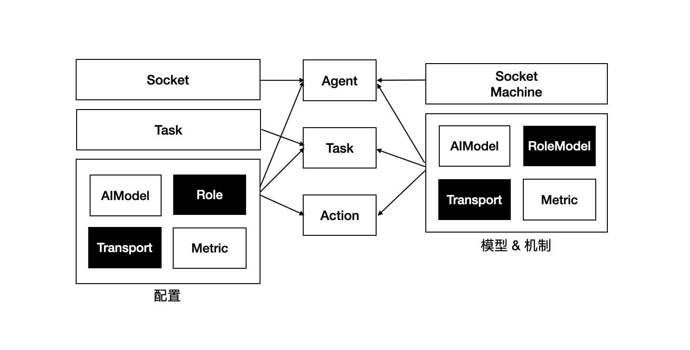

# 实体关系模型

## Design and implementation

  

### 配置
- `Socket`: Agent协商建立关系的通信方式，目前支持`MQTT`。
- `Task`: 任务相关配置，主要是任务名。
- `AIModel`: AI模型配置，包含模型名、温度等。
- `Role`: 角色相关配置，用于指定协调者、监督者等角色及它们在哪个任务中担任。
- `Transport`: Action之间通信的协议配置，目前支持`MQTT`、`RPC`。
- `Metric`: Task和Action指标阈值，及指标同步协议配置，其中，同步协议为`MQTT`。

Socket配置作用于Agent上，Task配置作用于Task上，其他配置可作用于Agent、Task及Action。

### 模型和机制
- `SocketMachine`: 用于建立Agent之间的协作关系，通过握手机制实现，参见[协商握手](./README_HANDSHAKE_CN)。
- `AIModel`: 主要用于AI模型调用和结果处理等。
- `RoleModel`: 主要包含协作者和监督者相关处理，参见[上下文-角色模型](./README_CONTEXT_ROLE.md)。
- `Transport`: Action之间通信协议的选择。
- `Metric`: Task、Action运行指标的收集和同步，参见[状态同步](./README_STATE_SYNC.md)。

所有模型和机制，与相关配置的作用域对应，比如，`AIModel` 作用于Agent，那么，该Agent上的所有Action都使用该模型，如果`AIModel` 作用于Task，那么，该Task所有Action都使用该模型，如果`AIModel` 作用于Action，那么，该Action使用该模型。  

*备注*：作用域优先级：Action > Task > Agent

### TouchPoint
TocuhPoint是整个通信过程中数据交换的核心载体。和Http类似，它也有相似的概念：
- Header：请求头，包含来源Action和目标Action，及两者的通信方式等。
- State：状态，包含响应状态码、响应消息、重定向目标Action等。
- Context：上下文，包含Task上下文、Action上下文等，开发者也可以[添加自定义上下文](../README_CONTEXT.md)。

`Action` 通过继承 `TouchPoint` 携带以上数据，贯穿整个Task。