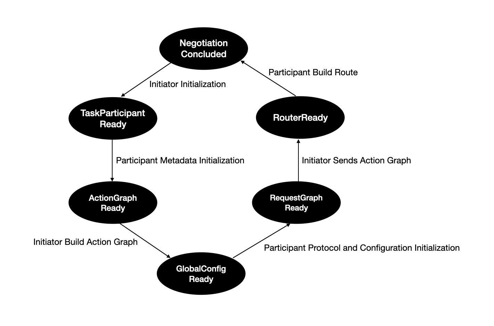

# Negotiation Handshake Mechanism

## Overview
TPP establishes collaboration relationships through six handshakes between the task initiator Agent and participant Agents.

### State Diagram

  

- **First Handshake**: The initiator completes its own initialization and notifies the participants to prepare for initialization.
- **Second Handshake**: The participant completes its own metadata initialization and notifies the initiator to prepare for constructing the Action Graph.
- **Third Handshake**: The initiator receives the participant's metadata, constructs the Action Graph using the metadata, and then notifies the participant to prepare for receiving the global configuration.
- **Fourth Handshake**: The participant receives the global configuration, initializes the transport protocol server with the configuration, and then requests the initiator to send the Action Graph.
- **Fifth Handshake**: The initiator sends the Action Graph and notifies the participant to prepare for constructing the route.
- **Sixth Handshake**: After the participant constructs the route based on the Action Graph, it informs the initiator that the collaboration relationship has been established.

### Context-Role Driven Model
In TPP, the coordinator changes an Action or the entire Action Graph in a task through the context-role driven model, triggering local collaboration states and their subsequent states.

#### Socket
The Socket provides an interface for external communication with TPP, where task context data is passed through this Socket. The data sources for this interface include:

- **User Space**: Programs in user space add data to the context by calling socket.send().
- **Kernel Space**: Hardware drivers in the kernel add data to the context by calling socket.send(). For example, a sensor driver calls socket.send() to add visual images to the context.

Through the interaction of context and the coordinator, local collaboration states are triggered.

- **Action Interaction**: The coordinator checks the data in the context and, based on the results, triggers local collaboration states.

For example, if a monitoring system detects that a particular Action in a task is repeatedly inferring too many times, it broadcasts this count to the Actions of the task via the socket. Any Action in the task compares this count with the threshold. If the count exceeds the threshold, the request is forwarded to the coordinator, which updates or replaces this Action in the context and triggers the third handshake and subsequent state changes.

- **Entire ActionGraph Interaction**: The coordinator checks the data in the context and, based on the results, triggers local collaboration states.

For example, during a heart bypass surgery, if the patient suddenly experiences arrhythmia, the robot's sensors will broadcast the heart rhythm data to the Actions of the task via the socket. Any Action in the surgery task will compare the heart rhythm with the corresponding plan and the current surgical procedure. If they are inconsistent, the request will be forwarded to the coordinator, which will update the surgical procedure to the ActionGraph corresponding to the arrhythmia plan, and then trigger the fifth handshake and subsequent state changes.