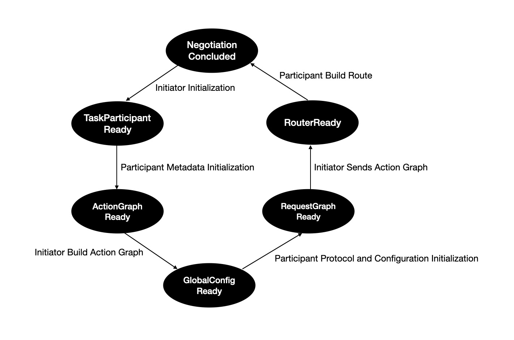

# 协商握手机制

## 概述
TPP通过任务发起者Agent和参与者Agents的6次握手来实现协作关系的建立。

### 状态图

  

- **第一次握手**：发起者完成自身初始化，通知参与者准备初始化。
- **第二次握手**：参与者完成自身元数据初始化，通知发起者准备构建Action Graph。
- **第三次握手**：发起者接收参与者元数据，使用元数据构建Action图，然后，通知参与者准备接收全局配置。
- **第四次握手**：参与者接收全局配置，使用配置初始化传输协议服务端，然后，请求发起者发送Action图。
- **第五次握手**：发起者发送Action图，通知参与者准备构建路由。
- **第六次握手**：参与者根据Action图构建路由后，告知发起者协作关系建立完成。

### 上下文-角色驱动模型
TPP中的协调者通过上下文-角色驱动模型变更任务中某个Action或整个Action图，触发局部协作状态及其后续状态。

#### Socket
该Socket提供了外部与TPP之间的通信接口，任务上下文数据通过该Socket传入，该接口的数据来源包括：

- 用户空间：用户空间的程序通过调用 `socket.send()` 将数据添加到上下文。
- 内核空间：内核中的硬件驱动通过调用 `socket.send()` 将数据添加到上下文中。比如：传感器驱动调用`socket.send()`，将视觉图像添加到上下文。

通过上下文和协调者联动，触发局部协作状态。

- Action联动：协调者检查上下文中的数据，然后，根据检查结果触发局部协作状态。

比如，监控系统发现一个任务的某个Action反复重新推理次数过多，则通过socket将该次数发送给该任务的其中一个可用的协调者，该协调者比较这个次数和阈值，发现该次数大于阈值，更新或替换上下文中的这个Action，然后，触发第三次握手及后续状态变更。

- 整个ActionGraph联动：协调者检查上下文中的数据，根据检查结果触发局部协作状态。

比如：手术机器人在做心脏搭桥手术过程中，突然病人心律失常，机器人的传感器会通过socket将心律数据发送给该任务的其中一个可用的协调者，该协调者比较这个心律对应的预案和当前手术流程是否一致，如果不一致，将手术流程更新为心律失常预案对应的ActionGraph，然后，触发第五次握手及后续状态变更。