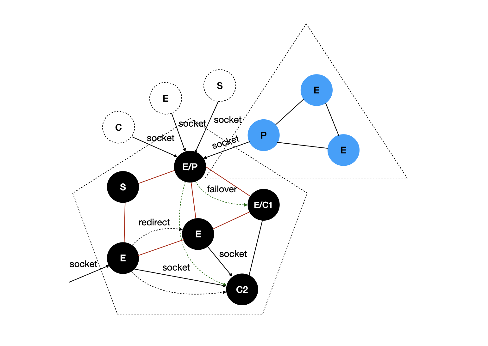

# Decentralization and Statelessness

  

TPP adopts a decentralized architecture to enable collaboration among multiple Actions. At the same time, TPP follows a stateless design, meaning that the execution status of each Action and the collaboration context among multiple Actions do not require state synchronization. Instead, this state information is preserved using Tokens.